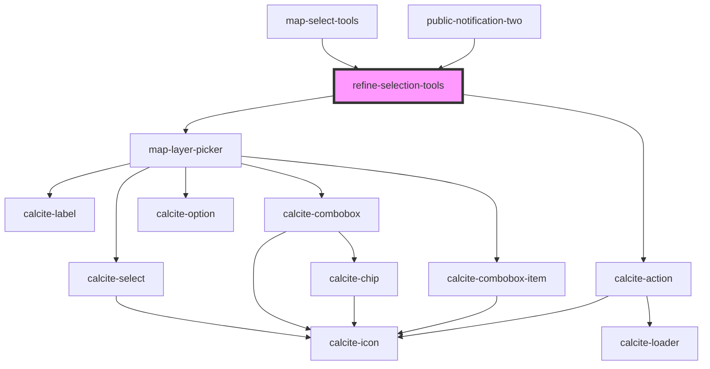

# refine-selection-tools

<!-- Auto Generated Below -->

## Properties

| Property         | Attribute          | Description                                                                                                                               | Type                                                                                        | Default     |
| ---------------- | ------------------ | ----------------------------------------------------------------------------------------------------------------------------------------- | ------------------------------------------------------------------------------------------- | ----------- |
| `active`         | `active`           | boolean: sketch is used by multiple components...need a way to know who should respond...                                                 | `boolean`                                                                                   | `false`     |
| `graphics`       | --                 | esri/Graphic: https://developers.arcgis.com/javascript/latest/api-reference/esri-Graphic.html                                             | `Graphic[]`                                                                                 | `undefined` |
| `ids`            | --                 | number: The oids of the selected features                                                                                                 | `number[]`                                                                                  | `[]`        |
| `layerView`      | --                 | esri/views/layers/LayerView: https://developers.arcgis.com/javascript/latest/api-reference/esri-views-layers-LayerView.html               | `FeatureLayerView`                                                                          | `undefined` |
| `layerViews`     | --                 | esri/views/layers/FeatureLayerView: https://developers.arcgis.com/javascript/latest/api-reference/esri-views-layers-FeatureLayerView.html | `FeatureLayerView[]`                                                                        | `[]`        |
| `mapView`        | --                 | esri/views/View: https://developers.arcgis.com/javascript/latest/api-reference/esri-views-MapView.html                                    | `MapView`                                                                                   | `undefined` |
| `mode`           | `mode`             | utils/interfaces/ESelectionMode: ADD, REMOVE                                                                                              | `ESelectionMode.ADD \| ESelectionMode.REMOVE`                                               | `undefined` |
| `refineMode`     | `refine-mode`      | utils/interfaces/ERefineMode: ALL, SUBSET                                                                                                 | `ERefineMode.ALL \| ERefineMode.SUBSET`                                                     | `undefined` |
| `selectEnbaled`  | `select-enbaled`   | boolean: Is selected enabled                                                                                                              | `boolean`                                                                                   | `false`     |
| `selectionMode`  | `selection-mode`   | utils/interfaces/ESelectionType: POINT, LINE, POLY, RECT                                                                                  | `ESelectionType.LINE \| ESelectionType.POINT \| ESelectionType.POLY \| ESelectionType.RECT` | `undefined` |
| `translations`   | `translations`     | Contains the translations for this component. All UI strings should be defined here.                                                      | `any`                                                                                       | `{}`        |
| `useLayerPicker` | `use-layer-picker` | boolean: Used to control the visibility of the layer picker                                                                               | `boolean`                                                                                   | `true`      |

## Events

| Event                   | Description | Type               |
| ----------------------- | ----------- | ------------------ |
| `refineSelectionChange` |             | `CustomEvent<any>` |

## Dependencies

### Used by

 - [map-select-tools](../map-select-tools)
 - [public-notification-two](../public-notification-two)

### Depends on

- [map-layer-picker](../map-layer-picker)
- calcite-action

### Graph

----------------------------------------------

*Built with [StencilJS](https://stenciljs.com/)*
