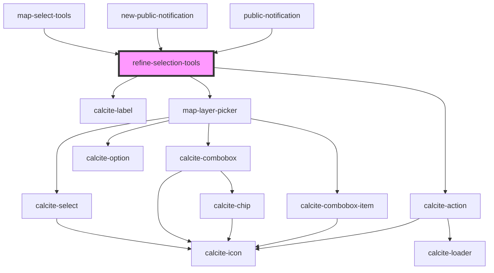

# refine-selection-tools

<!-- Auto Generated Below -->

## Properties

| Property         | Attribute          | Description                                                                                                                               | Type                                          | Default     |
| ---------------- | ------------------ | ----------------------------------------------------------------------------------------------------------------------------------------- | --------------------------------------------- | ----------- |
| `active`         | `active`           | boolean: sketch is used by multiple components...need a way to know who should respond...                                                 | `boolean`                                     | `false`     |
| `border`         | `border`           | boolean: Optionally draw a border around the draw tools                                                                                   | `boolean`                                     | `false`     |
| `graphics`       | --                 | esri/Graphic: https://developers.arcgis.com/javascript/latest/api-reference/esri-Graphic.html                                             | `Graphic[]`                                   | `undefined` |
| `ids`            | --                 | number: The oids of the selected features                                                                                                 | `number[]`                                    | `[]`        |
| `layerView`      | --                 | esri/views/layers/LayerView: https://developers.arcgis.com/javascript/latest/api-reference/esri-views-layers-LayerView.html               | `FeatureLayerView`                            | `undefined` |
| `layerViews`     | --                 | esri/views/layers/FeatureLayerView: https://developers.arcgis.com/javascript/latest/api-reference/esri-views-layers-FeatureLayerView.html | `FeatureLayerView[]`                          | `[]`        |
| `mapView`        | --                 | esri/views/View: https://developers.arcgis.com/javascript/latest/api-reference/esri-views-MapView.html                                    | `MapView`                                     | `undefined` |
| `mode`           | `mode`             | utils/interfaces/ESelectionMode: ADD, REMOVE                                                                                              | `ESelectionMode.ADD \| ESelectionMode.REMOVE` | `undefined` |
| `refineMode`     | `refine-mode`      | utils/interfaces/ERefineMode: ALL, SUBSET                                                                                                 | `ERefineMode.ALL \| ERefineMode.SUBSET`       | `undefined` |
| `useLayerPicker` | `use-layer-picker` | boolean: Used to control the visibility of the layer picker                                                                               | `boolean`                                     | `true`      |

## Events

| Event                           | Description | Type               |
| ------------------------------- | ----------- | ------------------ |
| `refineSelectionGraphicsChange` |             | `CustomEvent<any>` |
| `refineSelectionIdsChange`      |             | `CustomEvent<any>` |

## Methods

### `clearHighlight() => Promise<void>`

#### Returns

Type: `Promise<void>`

### `reset() => Promise<void>`

#### Returns

Type: `Promise<void>`

## Dependencies

### Used by

 - [map-select-tools](../map-select-tools)
 - [new-public-notification](../new-public-notification)
 - [public-notification](../public-notification)

### Depends on

- calcite-label
- [map-layer-picker](../map-layer-picker)
- calcite-action

### Graph

----------------------------------------------

*Built with [StencilJS](https://stenciljs.com/)*
