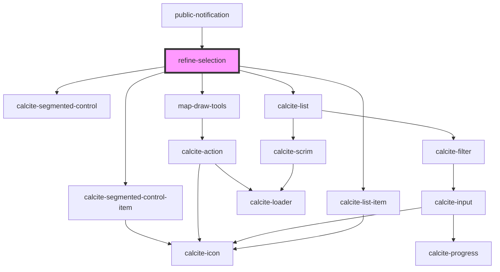

# refine-selection

<!-- Auto Generated Below -->

## Properties

| Property              | Attribute           | Description                                                                                                                                                | Type                 | Default     |
| --------------------- | ------------------- | ---------------------------------------------------------------------------------------------------------------------------------------------------------- | -------------------- | ----------- |
| `GraphicsLayer`       | `graphics-layer`    |                                                                                                                                                            | `any`                | `undefined` |
| `SketchViewModel`     | `sketch-view-model` |                                                                                                                                                            | `any`                | `undefined` |
| `addresseeLayer`      | --                  | esri/views/layers/FeatureLayerView: https://developers.arcgis.com/javascript/latest/api-reference/esri-views-layers-FeatureLayerView.html                  | `FeatureLayerView`   | `undefined` |
| `enabledLayerIds`     | --                  | string[]: Optional list of enabled layer ids  If empty all layers will be available                                                                        | `string[]`           | `[]`        |
| `mapView`             | --                  | esri/views/View: https://developers.arcgis.com/javascript/latest/api-reference/esri-views-MapView.html                                                     | `MapView`            | `undefined` |
| `selectionSets`       | --                  | utils/interfaces/ISelectionSet: An array of user defined selection sets                                                                                    | `ISelectionSet[]`    | `[]`        |
| `sketchLineSymbol`    | --                  | esri/symbols/SimpleLineSymbol \| JSON representation : https://developers.arcgis.com/javascript/latest/api-reference/esri-symbols-SimpleLineSymbol.html    | `SimpleLineSymbol`   | `undefined` |
| `sketchPointSymbol`   | --                  | esri/symbols/SimpleMarkerSymbol \| JSON representation: https://developers.arcgis.com/javascript/latest/api-reference/esri-symbols-SimpleMarkerSymbol.html | `SimpleMarkerSymbol` | `undefined` |
| `sketchPolygonSymbol` | --                  | esri/symbols/SimpleFillSymbol \| JSON representation: https://developers.arcgis.com/javascript/latest/api-reference/esri-symbols-SimpleFillSymbol.html     | `SimpleFillSymbol`   | `undefined` |

## Events

| Event                  | Description                                   | Type                           |
| ---------------------- | --------------------------------------------- | ------------------------------ |
| `selectionSetsChanged` | Emitted on demand when selection sets change. | `CustomEvent<ISelectionSet[]>` |

## Dependencies

### Used by

 - [public-notification](../public-notification)

### Depends on

- calcite-segmented-control
- calcite-segmented-control-item
- [map-draw-tools](../map-draw-tools)
- calcite-list
- calcite-list-item

### Graph

----------------------------------------------

*Built with [StencilJS](https://stenciljs.com/)*
