# solution-configuration

<!-- Auto Generated Below -->

## Properties

| Property                   | Attribute                   | Description                                   | Type     | Default |
| -------------------------- | --------------------------- | --------------------------------------------- | -------- | ------- |
| `serializedAuthentication` | `serialized-authentication` | Credentials for requests in a serialized form | `string` | `""`    |
| `solutionItemId`           | `solution-item-id`          | Contains the current solution item id         | `string` | `""`    |
| `solutionTitle`            | `solution-title`            |                                               | `string` | `""`    |

## Dependencies

### Depends on

- calcite-modal
- [solution-configuration](../solution-configuration)
- calcite-button

### Graph

```mermaid
graph TD;
  solution-config-modal --> calcite-modal
  solution-config-modal --> solution-configuration
  solution-config-modal --> calcite-button
  calcite-modal --> calcite-scrim
  calcite-modal --> calcite-icon
  calcite-scrim --> calcite-loader
  solution-configuration --> calcite-loader
  solution-configuration --> calcite-tabs
  solution-configuration --> calcite-tab-nav
  solution-configuration --> calcite-tab-title
  solution-configuration --> calcite-tab
  solution-configuration --> solution-contents
  solution-configuration --> calcite-button
  solution-configuration --> solution-item
  solution-configuration --> solution-spatial-ref
  calcite-tab-title --> calcite-icon
  solution-contents --> calcite-tree
  solution-contents --> calcite-tree-item
  solution-contents --> solution-item-icon
  calcite-tree-item --> calcite-icon
  calcite-tree-item --> calcite-checkbox
  calcite-button --> calcite-loader
  calcite-button --> calcite-icon
  solution-item --> calcite-tabs
  solution-item --> calcite-tab-nav
  solution-item --> calcite-tab-title
  solution-item --> calcite-tab
  solution-item --> solution-item-details
  solution-item --> solution-item-sharing
  solution-item --> solution-template-data
  solution-item --> solution-resource-item
  solution-item-details --> calcite-input
  solution-item-details --> calcite-label
  calcite-input --> calcite-progress
  calcite-input --> calcite-icon
  solution-item-sharing --> calcite-label
  solution-item-sharing --> calcite-switch
  solution-item-sharing --> solution-item-icon
  solution-template-data --> calcite-shell
  solution-template-data --> calcite-panel
  solution-template-data --> json-editor
  solution-template-data --> calcite-shell-panel
  solution-template-data --> calcite-button
  solution-template-data --> solution-organization-variables
  solution-template-data --> solution-variables
  calcite-panel --> calcite-action
  calcite-panel --> calcite-action-menu
  calcite-panel --> calcite-scrim
  calcite-action --> calcite-loader
  calcite-action --> calcite-icon
  calcite-action-menu --> calcite-action
  calcite-action-menu --> calcite-popover
  calcite-popover --> calcite-action
  calcite-popover --> calcite-icon
  json-editor --> calcite-icon
  json-editor --> calcite-button
  solution-organization-variables --> calcite-tree
  solution-organization-variables --> calcite-tree-item
  solution-variables --> calcite-tree
  solution-variables --> calcite-tree-item
  solution-variables --> solution-item-icon
  solution-resource-item --> calcite-button
  solution-resource-item --> calcite-value-list
  solution-resource-item --> calcite-value-list-item
  solution-resource-item --> calcite-action-group
  solution-resource-item --> calcite-action
  calcite-value-list-item --> calcite-icon
  calcite-value-list-item --> calcite-pick-list-item
  calcite-pick-list-item --> calcite-icon
  calcite-pick-list-item --> calcite-action
  calcite-action-group --> calcite-action-menu
  calcite-action-group --> calcite-action
  solution-spatial-ref --> calcite-label
  solution-spatial-ref --> calcite-switch
  solution-spatial-ref --> calcite-input
  solution-spatial-ref --> calcite-tree
  solution-spatial-ref --> calcite-tree-item
  style solution-config-modal fill:#f9f,stroke:#333,stroke-width:4px
```

----------------------------------------------

*Built with [StencilJS](https://stenciljs.com/)*
