# solution-configuration

<!-- Auto Generated Below -->

## Properties

| Property         | Attribute          | Description                                            | Type                     | Default                                                                                                            |
| ---------------- | ------------------ | ------------------------------------------------------ | ------------------------ | ------------------------------------------------------------------------------------------------------------------ |
| `authentication` | --                 | Credentials for requests                               | `UserSession`            | `undefined`                                                                                                        |
| `item`           | --                 | Contains the current solution item we are working with | `ISolutionItem`          | `{     itemId: "",     itemDetails: {},     isResource: false,     data: {},     properties: {},     type: ""   }` |
| `itemid`         | `itemid`           | Contains the current solution item id                  | `string`                 | `""`                                                                                                               |
| `sourceItemData` | `source-item-data` | Contains the current solution item id                  | `any`                    | `{}`                                                                                                               |
| `templates`      | --                 | Contains the raw templates from the solution item      | `any[]`                  | `undefined`                                                                                                        |
| `translations`   | `translations`     | Contains the translations for this component.          | `any`                    | `{}`                                                                                                               |
| `treeOpen`       | `tree-open`        | Used to show/hide the content tree                     | `boolean`                | `true`                                                                                                             |
| `value`          | --                 | Contains the public value for this component.          | `ISolutionConfiguration` | `{     contents: []   }`                                                                                           |

## Methods

### `getEditModels() => Promise<any>`

#### Returns

Type: `Promise<any>`

### `getSourceTemplates() => Promise<any[]>`

#### Returns

Type: `Promise<any[]>`

### `getSpatialReferenceInfo() => Promise<any>`

#### Returns

Type: `Promise<any>`

### `save() => Promise<IResponse>`

#### Returns

Type: `Promise<IResponse>`

## Dependencies

### Depends on

- calcite-tabs
- calcite-tab-nav
- calcite-tab-title
- calcite-tab
- [solution-contents](../solution-contents)
- calcite-button
- [solution-item](../solution-item)
- [solution-spatial-ref](../solution-spatial-ref)

### Graph

```mermaid
graph TD;
  solution-configuration --> calcite-tabs
  solution-configuration --> calcite-tab-nav
  solution-configuration --> calcite-tab-title
  solution-configuration --> calcite-tab
  solution-configuration --> solution-contents
  solution-configuration --> calcite-button
  solution-configuration --> solution-item
  solution-configuration --> solution-spatial-ref
  calcite-tab-title --> calcite-icon
  solution-contents --> calcite-tree
  solution-contents --> calcite-tree-item
  solution-contents --> solution-item-icon
  calcite-tree-item --> calcite-icon
  calcite-tree-item --> calcite-checkbox
  calcite-button --> calcite-loader
  calcite-button --> calcite-icon
  solution-item --> calcite-tabs
  solution-item --> calcite-tab-nav
  solution-item --> calcite-tab-title
  solution-item --> calcite-tab
  solution-item --> solution-item-details
  solution-item --> solution-item-sharing
  solution-item --> solution-template-data
  solution-item-details --> calcite-input
  solution-item-details --> calcite-label
  calcite-input --> calcite-progress
  calcite-input --> calcite-icon
  solution-item-sharing --> calcite-label
  solution-item-sharing --> calcite-switch
  solution-item-sharing --> solution-item-icon
  solution-template-data --> calcite-shell
  solution-template-data --> calcite-panel
  solution-template-data --> json-editor
  solution-template-data --> calcite-shell-panel
  solution-template-data --> calcite-button
  solution-template-data --> solution-organization-variables
  solution-template-data --> solution-variables
  solution-template-data --> solution-resource-item
  calcite-panel --> calcite-action
  calcite-panel --> calcite-action-menu
  calcite-panel --> calcite-scrim
  calcite-action --> calcite-loader
  calcite-action --> calcite-icon
  calcite-action-menu --> calcite-action
  calcite-action-menu --> calcite-tooltip-manager
  calcite-action-menu --> calcite-popover
  calcite-popover --> calcite-action
  calcite-popover --> calcite-icon
  calcite-scrim --> calcite-loader
  json-editor --> calcite-button
  json-editor --> calcite-icon
  solution-organization-variables --> calcite-label
  solution-organization-variables --> calcite-tree-item
  solution-variables --> calcite-label
  solution-variables --> calcite-tree-item
  solution-variables --> solution-item-icon
  solution-variables --> calcite-tree
  solution-resource-item --> calcite-label
  solution-resource-item --> calcite-button
  solution-spatial-ref --> calcite-switch
  solution-spatial-ref --> calcite-label
  solution-spatial-ref --> calcite-input
  solution-spatial-ref --> calcite-tree
  solution-spatial-ref --> calcite-tree-item
  style solution-configuration fill:#f9f,stroke:#333,stroke-width:4px
```

----------------------------------------------

*Built with [StencilJS](https://stenciljs.com/)*
