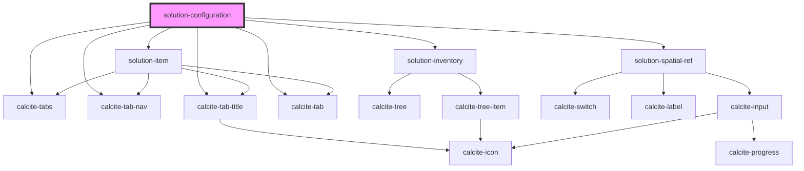

# solution-configuration

<!-- Auto Generated Below -->

## Dependencies

### Depends on

- calcite-tabs
- calcite-tab-nav
- calcite-tab-title
- calcite-tab
- [solution-inventory](../solution-inventory)
- [solution-item](../solution-item)
- [solution-spatial-ref](../solution-spatial-ref)

### Graph

----------------------------------------------

*Built with [StencilJS](https://stenciljs.com/)*
