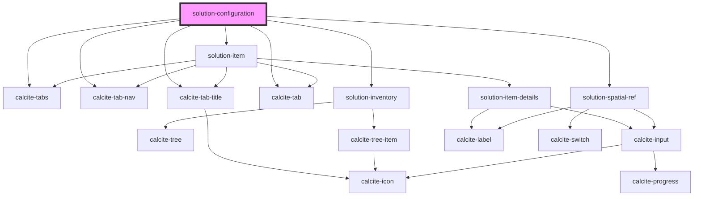

# solution-configuration

<!-- Auto Generated Below -->

## Properties

| Property       | Attribute      | Description                                   | Type  | Default                                                                                                                                                                                                                                                                                                                                                                                                                                                                                                                                                                                                                                                                                                                                                                                                                                                                                                                                                                                                                                                                                    |
| -------------- | -------------- | --------------------------------------------- | ----- | ------------------------------------------------------------------------------------------------------------------------------------------------------------------------------------------------------------------------------------------------------------------------------------------------------------------------------------------------------------------------------------------------------------------------------------------------------------------------------------------------------------------------------------------------------------------------------------------------------------------------------------------------------------------------------------------------------------------------------------------------------------------------------------------------------------------------------------------------------------------------------------------------------------------------------------------------------------------------------------------------------------------------------------------------------------------------------------------ |
| `translations` | `translations` | Contains the translations for this component. | `any` | `{     "definitionTab": "Definition", // for tab to edit definition of an item or group     "spatialReferenceTab": "Spatial Reference", // for tab to edit the spatial reference of an item      // Information about an item     "item": {       "itemDetailsTab": "Item Details",       "dataTab": "Data",       "propertiesTab": "Properties",       "groupDetailsTab": "Group Details",       "sharingTab": "Sharing",        // Item details       "itemDetails": {         "editThumbnail": "Edit Thumbnail",         "description": "Description",         "tags": "Tags",         "credits": "Credits",         "termsOfUse": "Terms of Use",         "snippetCountPattern": "{{n}} of 250"       },        "jsonEditing": {         "startEditing": "Start editing", // start modifying JSON in its editor         "search": "Search" // search within JSON editor       }     },      "spatialRef": {       "specifyParam": "Spatial Reference Parameter",       "defaultSpatialRef": "Default Spatial Reference",       "featureServicesHeading": "Feature Services"     }   }` |
| `value`        | `value`        | Contains the public value for this component. | `any` | `{}`                                                                                                                                                                                                                                                                                                                                                                                                                                                                                                                                                                                                                                                                                                                                                                                                                                                                                                                                                                                                                                                                                       |

## Dependencies

### Depends on

- calcite-tabs
- calcite-tab-nav
- calcite-tab-title
- calcite-tab
- [solution-inventory](../solution-inventory)
- [solution-item](../solution-item)
- [solution-spatial-ref](../solution-spatial-ref)

### Graph

----------------------------------------------

*Built with [StencilJS](https://stenciljs.com/)*
