# solution-configuration

<!-- Auto Generated Below -->

## Properties

| Property       | Attribute      | Description                                   | Type                     | Default                                                                                                                                                            |
| -------------- | -------------- | --------------------------------------------- | ------------------------ | ------------------------------------------------------------------------------------------------------------------------------------------------------------------ |
| `translations` | `translations` | Contains the translations for this component. | `any`                    | `{}`                                                                                                                                                               |
| `value`        | --             | Contains the public value for this component. | `ISolutionConfiguration` | `{     contents: [],     item: {       itemId: "",       itemDetails: {},       isResource: false,       data: {},       properties: {},       type: ""     }   }` |

## Dependencies

### Depends on

- calcite-tabs
- calcite-tab-nav
- calcite-tab-title
- calcite-tab
- [solution-contents](../solution-contents)
- [solution-item](../solution-item)
- [solution-spatial-ref](../solution-spatial-ref)

### Graph

```mermaid
graph TD;
  solution-configuration --> calcite-tabs
  solution-configuration --> calcite-tab-nav
  solution-configuration --> calcite-tab-title
  solution-configuration --> calcite-tab
  solution-configuration --> solution-contents
  solution-configuration --> solution-item
  solution-configuration --> solution-spatial-ref
  calcite-tab-title --> calcite-icon
  solution-contents --> calcite-tree
  solution-contents --> calcite-tree-item
  solution-contents --> solution-item-icon
  calcite-tree-item --> calcite-icon
  solution-item --> calcite-tabs
  solution-item --> calcite-tab-nav
  solution-item --> calcite-tab-title
  solution-item --> calcite-tab
  solution-item --> solution-item-details
  solution-item --> solution-item-sharing
  solution-item --> solution-template-data
  solution-item-details --> calcite-input
  solution-item-details --> calcite-label
  calcite-input --> calcite-progress
  calcite-input --> calcite-icon
  solution-item-sharing --> calcite-label
  solution-item-sharing --> calcite-switch
  solution-item-sharing --> solution-item-icon
  solution-template-data --> calcite-shell
  solution-template-data --> calcite-shell-center-row
  solution-template-data --> json-editor
  solution-template-data --> calcite-shell-panel
  solution-template-data --> solution-organization-variables
  solution-template-data --> solution-variables
  solution-template-data --> solution-resource-item
  json-editor --> calcite-button
  json-editor --> calcite-icon
  calcite-button --> calcite-loader
  calcite-button --> calcite-icon
  solution-organization-variables --> calcite-label
  solution-organization-variables --> calcite-tree-item
  solution-variables --> calcite-label
  solution-variables --> calcite-tree-item
  solution-variables --> calcite-tree
  solution-resource-item --> calcite-label
  solution-resource-item --> calcite-button
  solution-spatial-ref --> calcite-switch
  solution-spatial-ref --> calcite-label
  solution-spatial-ref --> calcite-input
  style solution-configuration fill:#f9f,stroke:#333,stroke-width:4px
```

----------------------------------------------

*Built with [StencilJS](https://stenciljs.com/)*
