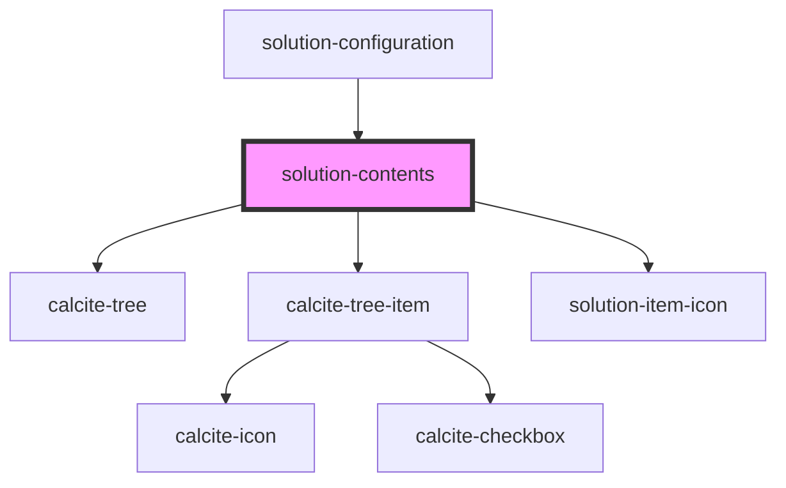

# solution-inventory

<!-- Auto Generated Below -->

## Properties

| Property            | Attribute | Description                                   | Type               | Default     |
| ------------------- | --------- | --------------------------------------------- | ------------------ | ----------- |
| `selectedItem`      | --        | Contains the current item that is selected.   | `ICurrentEditItem` | `undefined` |
| `templateHierarchy` | --        | Contains the public value for this component. | `IInventoryItem[]` | `[]`        |

## Events

| Event                  | Description | Type                            |
| ---------------------- | ----------- | ------------------------------- |
| `solutionItemSelected` |             | `CustomEvent<ICurrentEditItem>` |

## Dependencies

### Used by

 - [solution-configuration](../solution-configuration)

### Depends on

- calcite-tree
- calcite-tree-item
- [solution-item-icon](../solution-item-icon)

### Graph

----------------------------------------------

*Built with [StencilJS](https://stenciljs.com/)*
