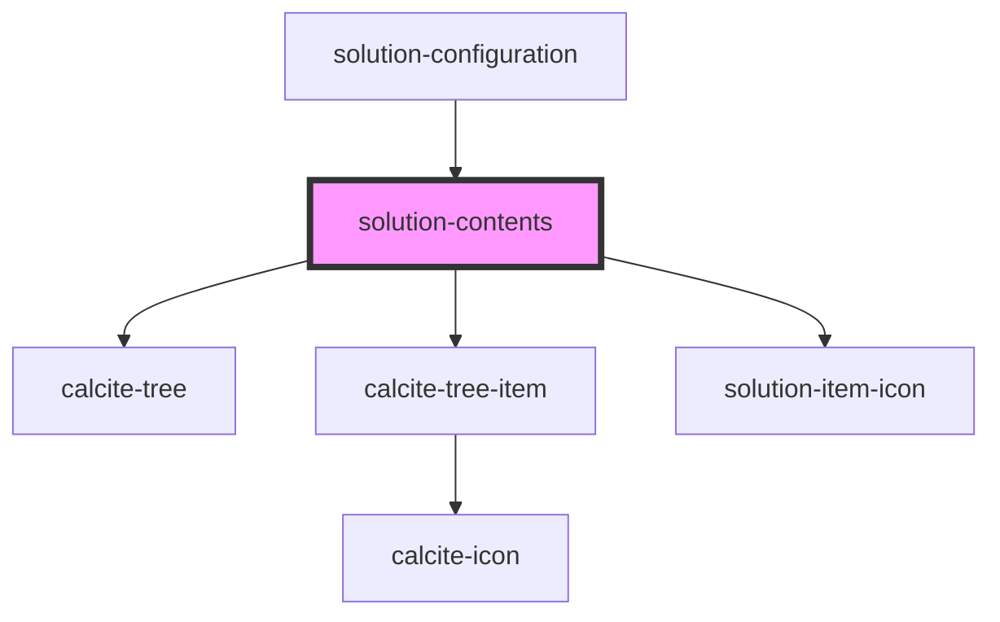

# solution-inventory

<!-- Auto Generated Below -->

## Properties

| Property       | Attribute      | Description                                   | Type               | Default |
| -------------- | -------------- | --------------------------------------------- | ------------------ | ------- |
| `translations` | `translations` | Contains the translations for this component. | `any`              | `{}`    |
| `value`        | --             | Contains the public value for this component. | `IInventoryItem[]` | `[]`    |

## Events

| Event                  | Description | Type               |
| ---------------------- | ----------- | ------------------ |
| `solutionItemSelected` |             | `CustomEvent<any>` |

## Dependencies

### Used by

 - [solution-configuration](../solution-configuration)

### Depends on

- calcite-tree
- calcite-tree-item
- [solution-item-icon](../solution-item-icon)

### Graph

----------------------------------------------

*Built with [StencilJS](https://stenciljs.com/)*
