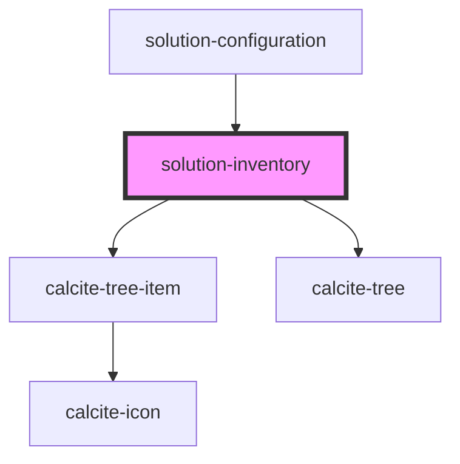

# solution-inventory

<!-- Auto Generated Below -->

## Properties

| Property       | Attribute      | Description                                   | Type               | Default                                                                                                                                                                                                                                                                                                                                                                                                                                                                                                                                                                                                                                                                                                                                                                                                                                                                                                                            |
| -------------- | -------------- | --------------------------------------------- | ------------------ | ---------------------------------------------------------------------------------------------------------------------------------------------------------------------------------------------------------------------------------------------------------------------------------------------------------------------------------------------------------------------------------------------------------------------------------------------------------------------------------------------------------------------------------------------------------------------------------------------------------------------------------------------------------------------------------------------------------------------------------------------------------------------------------------------------------------------------------------------------------------------------------------------------------------------------------- |
| `translations` | `translations` | Contains the translations for this component. | `any`              | `{   }`                                                                                                                                                                                                                                                                                                                                                                                                                                                                                                                                                                                                                                                                                                                                                                                                                                                                                                                            |
| `value`        | --             | Contains the public value for this component. | `IInventoryItem[]` | `[ {   "id": "1",   "title": "Dashboard 1" }, {   "id": "2",    "title": "Dashboard 2",   "dependencies": [{     "id": "3",     "title": "Map 1",     "dependencies": [{       "id": "4",       "title": "View 1",       "dependencies": [{         "id": "5",         "title": "Feature Service 1"       }]     }]   }] }, {   "id": "6",    "title": "Application 1",   "dependencies": [{     "id": "7",     "title": "Group 1",     "dependencies": [{       "id": "8",       "title": "Map 2",       "dependencies": [{         "id": "9",         "title": "Feature Service 2"       }, {         "id": "10",         "title": "Feature Service 3"       }, {         "id": "11",         "title": "Map 3",         "dependencies": [{           "id": "12",           "title": "Feature Service 4"         }]       }]     }]   }] }, {   "id": "13",   "title": "Notebook 1" }, {   "id": "14",   "title": "Survey 1" } ]` |

## Events

| Event                  | Description | Type               |
| ---------------------- | ----------- | ------------------ |
| `solutionItemSelected` |             | `CustomEvent<any>` |

## Dependencies

### Used by

 - [solution-configuration](../solution-configuration)

### Depends on

- calcite-tree-item
- calcite-tree

### Graph

----------------------------------------------

*Built with [StencilJS](https://stenciljs.com/)*
