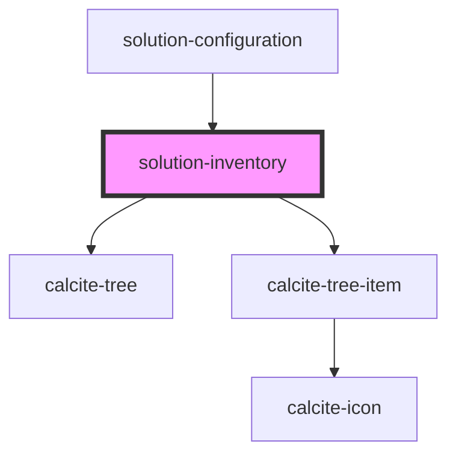

# solution-inventory

<!-- Auto Generated Below -->

## Properties

| Property       | Attribute      | Description                                   | Type  | Default |
| -------------- | -------------- | --------------------------------------------- | ----- | ------- |
| `translations` | `translations` | Contains the translations for this component. | `any` | `{   }` |
| `value`        | `value`        | Contains the public value for this component. | `any` | `{}`    |

## Dependencies

### Used by

 - [solution-configuration](../solution-configuration)

### Depends on

- calcite-tree
- calcite-tree-item

### Graph

----------------------------------------------

*Built with [StencilJS](https://stenciljs.com/)*
