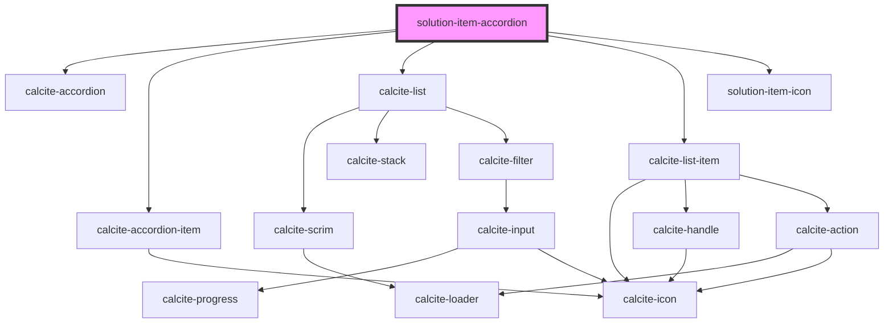

# solution-item-accordion

<!-- Auto Generated Below -->

## Properties

| Property        | Attribute | Description                                   | Type              | Default |
| --------------- | --------- | --------------------------------------------- | ----------------- | ------- |
| `templateInfos` | --        | ITemplateInfo[]: Collection of template infos | `ITemplateInfo[]` | `[]`    |

## Dependencies

### Depends on

- calcite-accordion
- calcite-accordion-item
- calcite-list
- calcite-list-item
- [solution-item-icon](../solution-item-icon)

### Graph

----------------------------------------------

*Built with [StencilJS](https://stenciljs.com/)*
