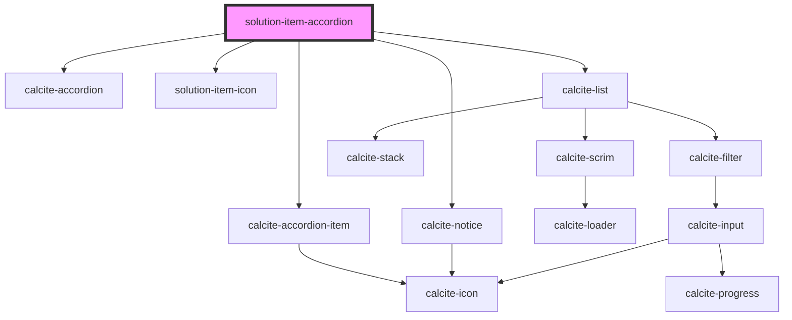

# solution-item-accordion

<!-- Auto Generated Below -->

## Properties

| Property     | Attribute     | Description                                  | Type     | Default     |
| ------------ | ------------- | -------------------------------------------- | -------- | ----------- |
| `solitionId` | `solition-id` | string: The id for the current solution item | `string` | `undefined` |

## Dependencies

### Depends on

- calcite-accordion
- calcite-accordion-item
- calcite-notice
- [solution-item-icon](../solution-item-icon)
- calcite-list

### Graph

----------------------------------------------

*Built with [StencilJS](https://stenciljs.com/)*
