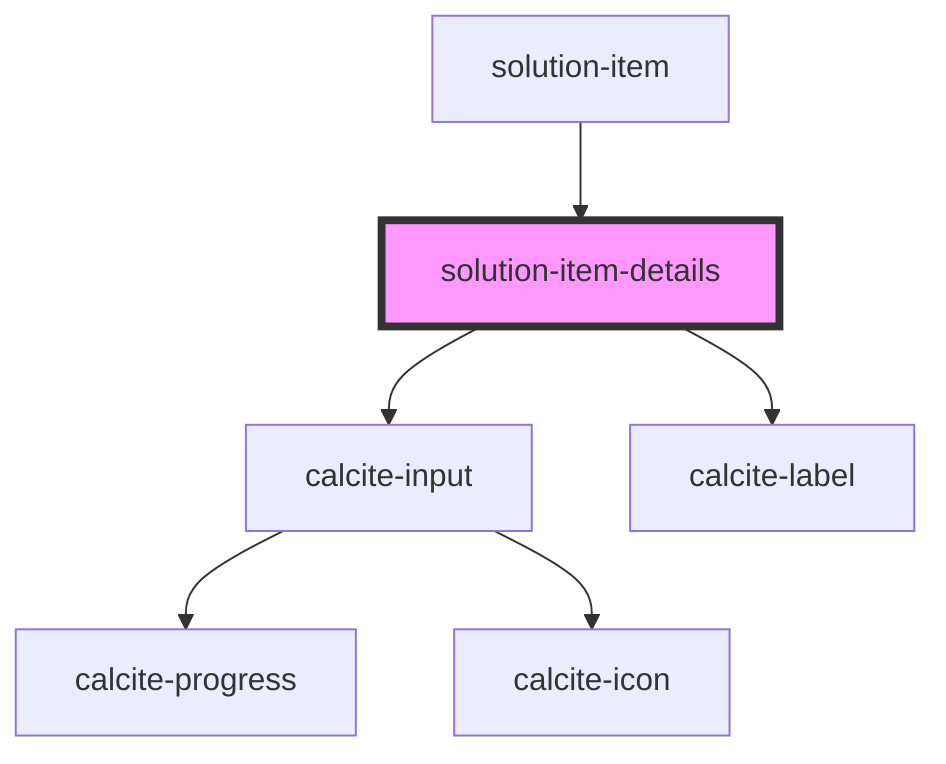

# solution-item-details

<!-- Auto Generated Below -->

## Properties

| Property       | Attribute      | Description | Type  | Default                                                                                                                                                                                                    |
| -------------- | -------------- | ----------- | ----- | ---------------------------------------------------------------------------------------------------------------------------------------------------------------------------------------------------------- |
| `translations` | `translations` |             | `any` | `{     "editThumbnail": "Edit Thumbnail",     "description": "Description",     "tags": "Tags",     "credits": "Credits",     "termsOfUse": "Terms of Use",     "snippetCountPattern": "{{n}} of 250"   }` |
| `value`        | `value`        |             | `any` | `{}`                                                                                                                                                                                                       |

## Dependencies

### Used by

 - [solution-item](../solution-item)

### Depends on

- calcite-input
- calcite-label

### Graph

----------------------------------------------

*Built with [StencilJS](https://stenciljs.com/)*
