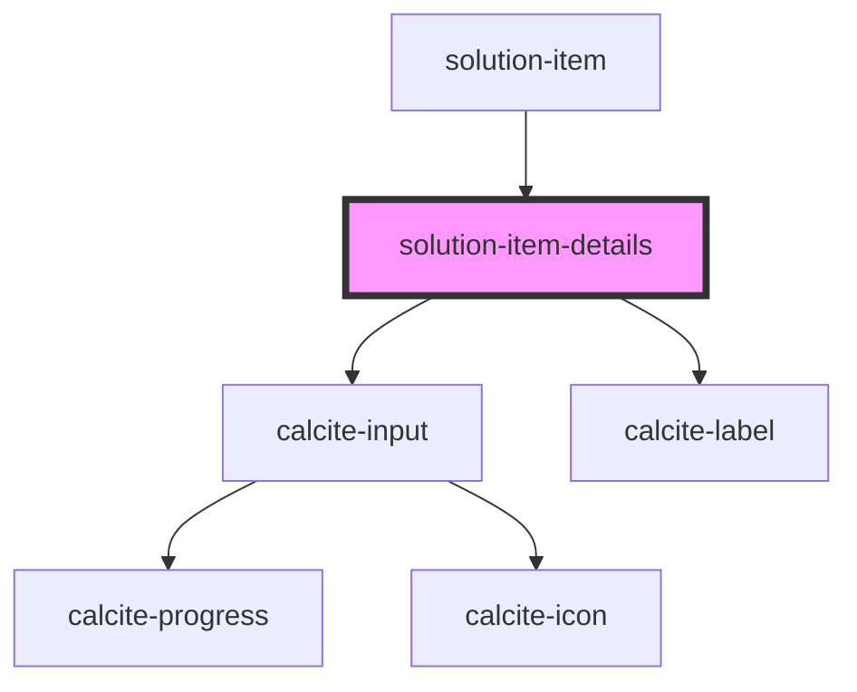

# solution-item-details

<!-- Auto Generated Below -->

## Properties

| Property       | Attribute      | Description                                   | Type           | Default                                                                                                                             |
| -------------- | -------------- | --------------------------------------------- | -------------- | ----------------------------------------------------------------------------------------------------------------------------------- |
| `translations` | `translations` | Contains the translations for this component. | `any`          | `{}`                                                                                                                                |
| `type`         | `type`         |                                               | `string`       | `""`                                                                                                                                |
| `value`        | --             | Contains the public value for this component. | `IItemDetails` | `{     thumbnail: null,     title: "",     snippet: "",     description: "",     tags: [],     credits: "",     termsOfUse: ""   }` |

## Dependencies

### Used by

 - [solution-item](../solution-item)

### Depends on

- calcite-input
- calcite-label

### Graph

----------------------------------------------

*Built with [StencilJS](https://stenciljs.com/)*
