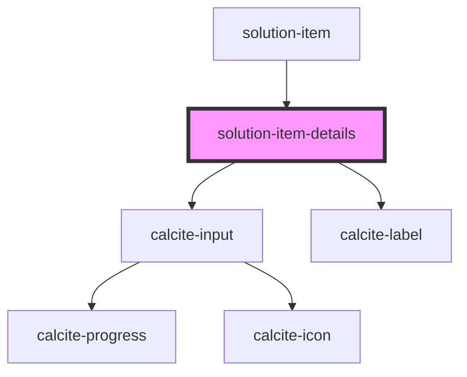

# solution-item-details

<!-- Auto Generated Below -->

## Properties

| Property | Attribute | Description                                   | Type           | Default                                                                                                                                   |
| -------- | --------- | --------------------------------------------- | -------------- | ----------------------------------------------------------------------------------------------------------------------------------------- |
| `type`   | `type`    | Contains the public type for this component.  | `string`       | `""`                                                                                                                                      |
| `value`  | --        | Contains the public value for this component. | `IItemDetails` | `{     title: "",     snippet: "",     description: "",     tags: [],     accessInformation: "",     licenseInfo: "",     itemId: ""   }` |

## Dependencies

### Used by

 - [solution-item](../solution-item)

### Depends on

- calcite-input
- calcite-label

### Graph

----------------------------------------------

*Built with [StencilJS](https://stenciljs.com/)*
