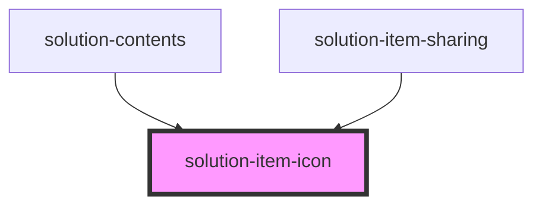

# solution-item-icon

<!-- Auto Generated Below -->

## Properties

| Property       | Attribute   | Description                   | Type       | Default |
| -------------- | ----------- | ----------------------------- | ---------- | ------- |
| `isPortal`     | `is-portal` | Indicate if this is portal    | `boolean`  | `false` |
| `type`         | `type`      | The type for the item         | `string`   | `""`    |
| `typeKeywords` | --          | The typeKeywords for the item | `string[]` | `[]`    |

## Dependencies

### Used by

 - [solution-contents](../solution-contents)
 - [solution-item-sharing](../solution-item-sharing)

### Graph

----------------------------------------------

*Built with [StencilJS](https://stenciljs.com/)*
