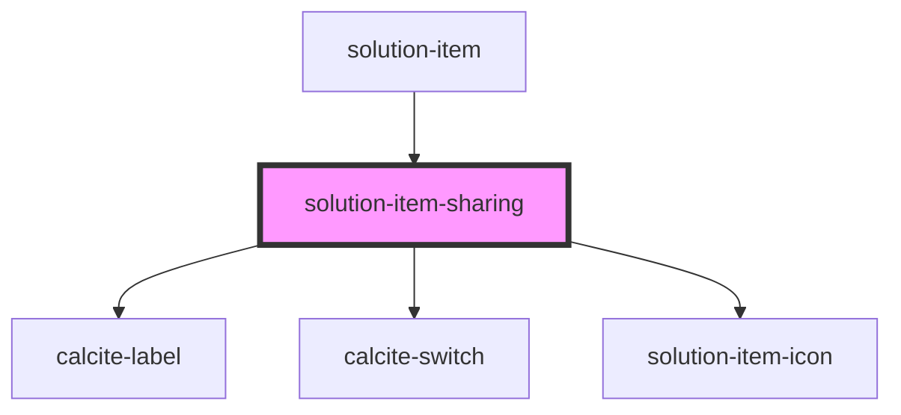

# solution-item-sharing

<!-- Auto Generated Below -->

## Properties

| Property       | Attribute      | Description                                                                        | Type           | Default     |
| -------------- | -------------- | ---------------------------------------------------------------------------------- | -------------- | ----------- |
| `groupId`      | `group-id`     | Contains the public id for the group these items will be shared or un-shared with. | `string`       | `undefined` |
| `translations` | `translations` | Contains the translations for this component.                                      | `any`          | `{}`        |
| `value`        | --             | Contains the public value for this component.                                      | `IItemShare[]` | `[]`        |

## Dependencies

### Used by

 - [solution-item](../solution-item)

### Depends on

- calcite-label
- calcite-switch
- [solution-item-icon](../solution-item-icon)

### Graph

----------------------------------------------

*Built with [StencilJS](https://stenciljs.com/)*
