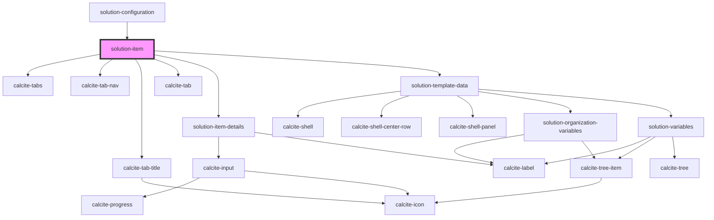

# solution-item

<!-- Auto Generated Below -->

## Properties

| Property       | Attribute      | Description                                   | Type  | Default                                                                                                                                                                                                                                                                                                                                                                                                                                                                                                                                                                                                     |
| -------------- | -------------- | --------------------------------------------- | ----- | ----------------------------------------------------------------------------------------------------------------------------------------------------------------------------------------------------------------------------------------------------------------------------------------------------------------------------------------------------------------------------------------------------------------------------------------------------------------------------------------------------------------------------------------------------------------------------------------------------------- |
| `translations` | `translations` | Contains the translations for this component. | `any` | `{     "itemDetailsTab": "Item Details",     "dataTab": "Data",     "propertiesTab": "Properties",     "groupDetailsTab": "Group Details",     "sharingTab": "Sharing",      // Item details     "itemDetails": {       "editThumbnail": "Edit Thumbnail",       "description": "Description",       "tags": "Tags",       "credits": "Credits",       "termsOfUse": "Terms of Use",       "snippetCountPattern": "{{n}} of 250"     },      "jsonEditing": {       "startEditing": "Start editing", // start modifying JSON in its editor       "search": "Search" // search within JSON editor     }   }` |
| `value`        | `value`        | Contains the public value for this component. | `any` | `{}`                                                                                                                                                                                                                                                                                                                                                                                                                                                                                                                                                                                                        |

## Dependencies

### Used by

 - [solution-configuration](../solution-configuration)

### Depends on

- calcite-tabs
- calcite-tab-nav
- calcite-tab-title
- calcite-tab
- [solution-item-details](../solution-item-details)
- [solution-template-data](../solution-template-data)

### Graph

----------------------------------------------

*Built with [StencilJS](https://stenciljs.com/)*
