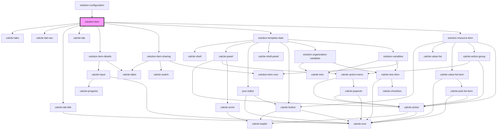

# solution-item

<!-- Auto Generated Below -->

## Properties

| Property                | Attribute                | Description                               | Type          | Default     |
| ----------------------- | ------------------------ | ----------------------------------------- | ------------- | ----------- |
| `authentication`        | --                       | Credentials for requests                  | `UserSession` | `undefined` |
| `itemId`                | `item-id`                | A template's itemId.                      | `string`      | `""`        |
| `organizationVariables` | `organization-variables` | Contains the organization based variables | `string`      | `""`        |
| `solutionVariables`     | `solution-variables`     | Contains the solution based variables     | `string`      | `""`        |

## Dependencies

### Used by

 - [solution-configuration](../solution-configuration)

### Depends on

- calcite-tabs
- calcite-tab-nav
- calcite-tab-title
- calcite-tab
- [solution-item-details](../solution-item-details)
- [solution-item-sharing](../solution-item-sharing)
- [solution-template-data](../solution-template-data)
- [solution-resource-item](../solution-resource-item)

### Graph

----------------------------------------------

*Built with [StencilJS](https://stenciljs.com/)*
