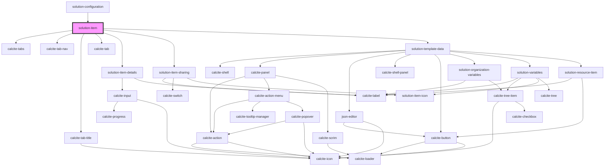

# solution-item

<!-- Auto Generated Below -->

## Properties

| Property                | Attribute      | Description                                   | Type            | Default                                                                                                                                         |
| ----------------------- | -------------- | --------------------------------------------- | --------------- | ----------------------------------------------------------------------------------------------------------------------------------------------- |
| `organizationVariables` | --             | Contains the organization based variables     | `any[]`         | `[]`                                                                                                                                            |
| `solutionVariables`     | --             | Contains the solution based variables         | `any[]`         | `[]`                                                                                                                                            |
| `translations`          | `translations` | Contains the translations for this component. | `any`           | `{}`                                                                                                                                            |
| `value`                 | --             | Contains the public value for this component. | `ISolutionItem` | `{     itemId: "",     itemDetails: {},     isResource: false,     data: {},     properties: {},     type: "",     groupDetails: undefined   }` |

## Dependencies

### Used by

 - [solution-configuration](../solution-configuration)

### Depends on

- calcite-tabs
- calcite-tab-nav
- calcite-tab-title
- calcite-tab
- [solution-item-details](../solution-item-details)
- [solution-item-sharing](../solution-item-sharing)
- [solution-template-data](../solution-template-data)

### Graph

----------------------------------------------

*Built with [StencilJS](https://stenciljs.com/)*
