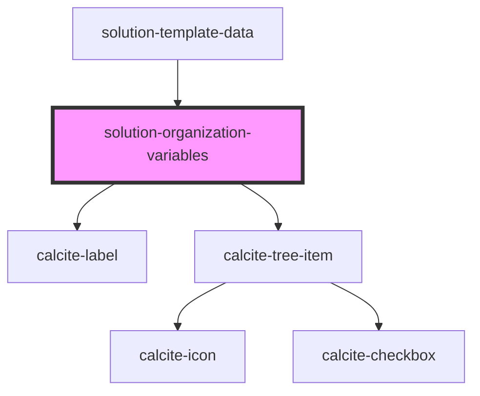

# solution-organization-variables

<!-- Auto Generated Below -->

## Properties

| Property | Attribute | Description                                   | Type                          | Default |
| -------- | --------- | --------------------------------------------- | ----------------------------- | ------- |
| `value`  | --        | Contains the public value for this component. | `IOrganizationVariableItem[]` | `[]`    |

## Events

| Event                          | Description | Type                                              |
| ------------------------------ | ----------- | ------------------------------------------------- |
| `organizationVariableSelected` |             | `CustomEvent<{ itemId: string; value: string; }>` |

## Dependencies

### Used by

 - [solution-template-data](../solution-template-data)

### Depends on

- calcite-label
- calcite-tree-item

### Graph

----------------------------------------------

*Built with [StencilJS](https://stenciljs.com/)*
