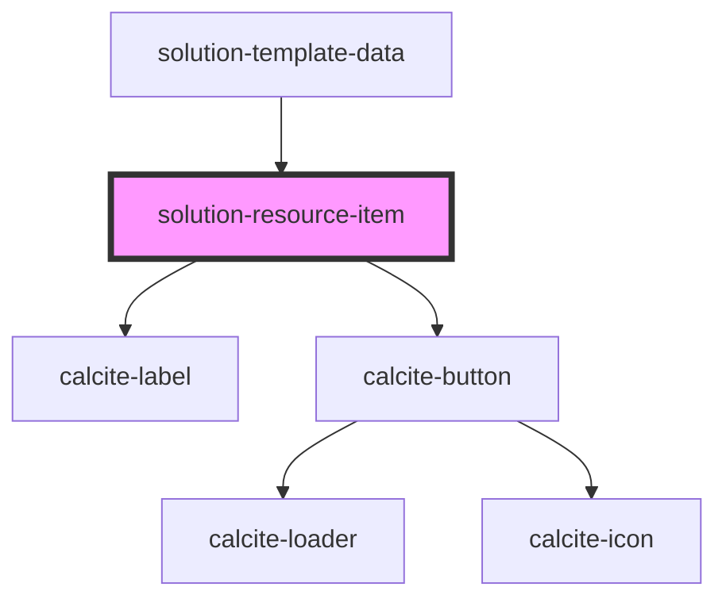

# solution-resource-item

<!-- Auto Generated Below -->

## Properties

| Property       | Attribute      | Description                                   | Type            | Default                                                |
| -------------- | -------------- | --------------------------------------------- | --------------- | ------------------------------------------------------ |
| `translations` | `translations` | Contains the translations for this component. | `any`           | `{     update: "Update",     download: "Download"   }` |
| `value`        | --             | Contains the public value for this component. | `IResourceItem` | `{     name: "",     url: ""   }`                      |

## Dependencies

### Used by

 - [solution-template-data](../solution-template-data)

### Depends on

- calcite-label
- calcite-button

### Graph

----------------------------------------------

*Built with [StencilJS](https://stenciljs.com/)*
