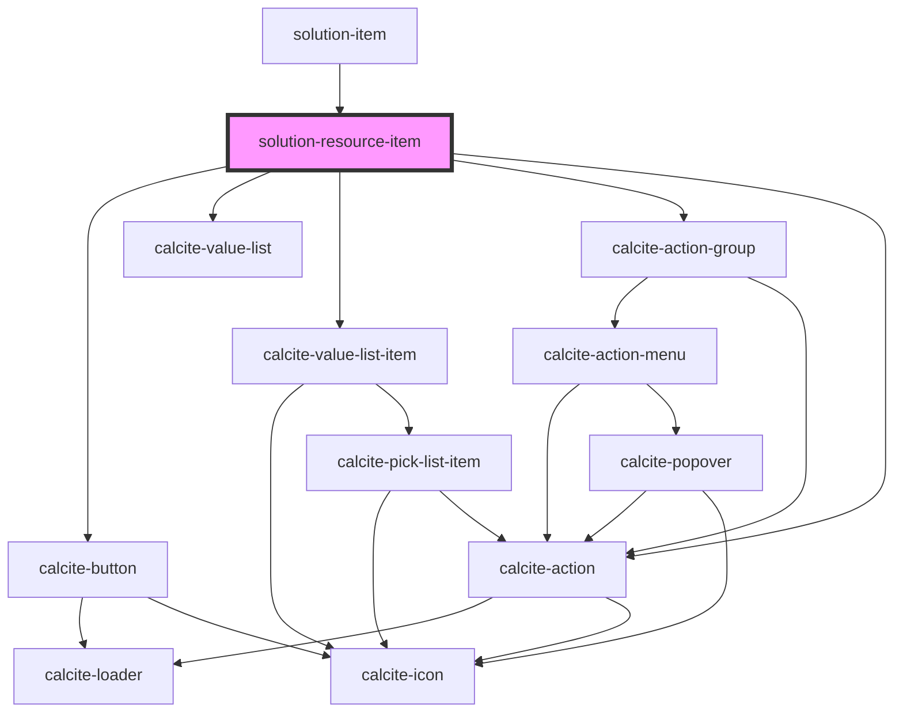

# solution-resource-item

<!-- Auto Generated Below -->

## Properties

| Property         | Attribute | Description                                                                                | Type          | Default     |
| ---------------- | --------- | ------------------------------------------------------------------------------------------ | ------------- | ----------- |
| `authentication` | --        | Credentials for requests                                                                   | `UserSession` | `undefined` |
| `itemId`         | `item-id` | A template's itemId. This is used to get the correct model from a store in the json-editor | `string`      | `""`        |

## Dependencies

### Used by

 - [solution-item](../solution-item)

### Depends on

- calcite-button
- calcite-value-list
- calcite-value-list-item
- calcite-action-group
- calcite-action

### Graph

----------------------------------------------

*Built with [StencilJS](https://stenciljs.com/)*
