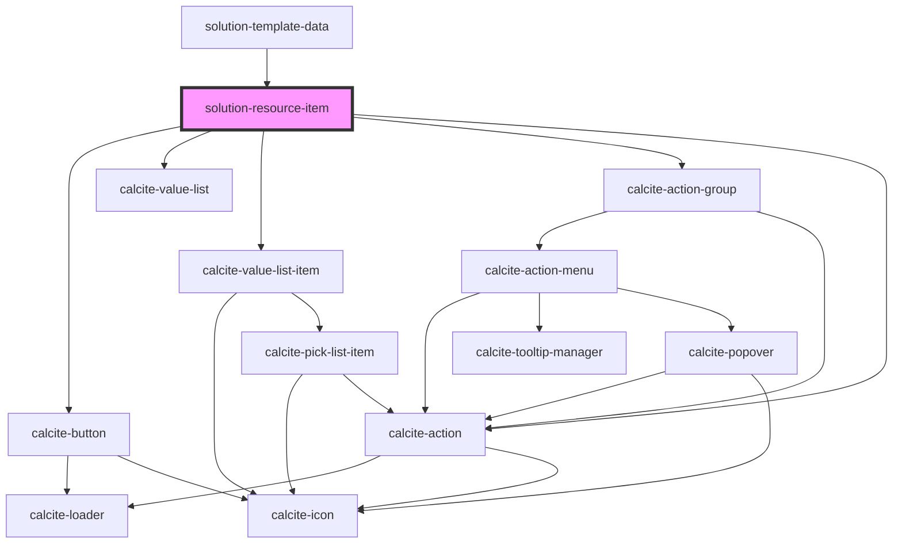

# solution-resource-item

<!-- Auto Generated Below -->

## Properties

| Property            | Attribute      | Description                                                                                 | Type              | Default     |
| ------------------- | -------------- | ------------------------------------------------------------------------------------------- | ----------------- | ----------- |
| `authentication`    | --             | Credentials for requests                                                                    | `UserSession`     | `undefined` |
| `itemid`            | `itemid`       | The templates itemId. This is used to get the correct model from a store in the json-editor | `string`          | `""`        |
| `resourceFilePaths` | --             | The templates resourceFilePaths.                                                            | `IResourcePath[]` | `[]`        |
| `resources`         | --             | The templates resources.                                                                    | `{}`              | `{}`        |
| `translations`      | `translations` | Contains the translations for this component.                                               | `any`             | `{}`        |

## Dependencies

### Used by

 - [solution-template-data](../solution-template-data)

### Depends on

- calcite-button
- calcite-value-list
- calcite-value-list-item
- calcite-action-group
- calcite-action

### Graph

----------------------------------------------

*Built with [StencilJS](https://stenciljs.com/)*
