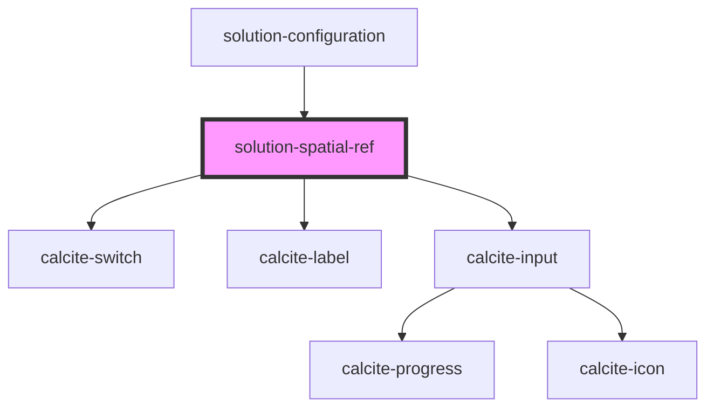

# solution-spatial-ref

<!-- Auto Generated Below -->

## Properties

| Property       | Attribute      | Description                                   | Type     | Default                                                                                                                                                           |
| -------------- | -------------- | --------------------------------------------- | -------- | ----------------------------------------------------------------------------------------------------------------------------------------------------------------- |
| `translations` | `translations` | Contains the translations for this component. | `any`    | `{     "specifyParam": "Spatial Reference Parameter",     "defaultSpatialRef": "Default Spatial Reference",     "featureServicesHeading": "Feature Services"   }` |
| `value`        | `value`        | Contains the public value for this component. | `string` | `null`                                                                                                                                                            |

## Methods

### `createSpatialRefDisplay(value: string) => Promise<ISpatialRefRepresentation>`

Returns the spatial reference description of the supplied value.
(Exposes private method `_createSpatialRefDisplay` for testing.)

#### Returns

Type: `Promise<ISpatialRefRepresentation>`

### `getSpatialRef() => Promise<ISpatialRefRepresentation>`

Returns the current spatial reference description.
(Exposes private variable `spatialRef` for testing.)

#### Returns

Type: `Promise<ISpatialRefRepresentation>`

### `wkidToDisplay(wkid: number) => Promise<string>`

Converts a WKID into a spatial reference description.
(Exposes private method `_wkidToDisplay` for testing.)

#### Returns

Type: `Promise<string>`

## Dependencies

### Used by

 - [solution-configuration](../solution-configuration)

### Depends on

- calcite-switch
- calcite-label
- calcite-input

### Graph

----------------------------------------------

*Built with [StencilJS](https://stenciljs.com/)*
