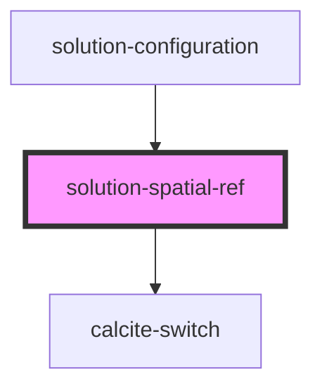

# solution-spatial-ref

<!-- Auto Generated Below -->

## Properties

| Property      | Attribute      | Description                                                                                                                         | Type                             | Default                       |
| ------------- | -------------- | ----------------------------------------------------------------------------------------------------------------------------------- | -------------------------------- | ----------------------------- |
| `defaultWkid` | `default-wkid` | The wkid that will be used as the default when no user selection has been made.                                                     | `number`                         | `3857`                        |
| `loaded`      | `loaded`       | Indicates if the control has been enabled. The first time Spatial Reference has been enabled it should enable all feature services. | `boolean`                        | `false`                       |
| `locked`      | `locked`       | When true, all but the main switch are disabled to prevent interaction.                                                             | `boolean`                        | `true`                        |
| `services`    | --             | List of services the spatial reference should apply to                                                                              | `IFeatureServiceEnabledStatus[]` | `[]`                          |
| `value`       | `value`        | Contains the public value for this component, which is a wkid or a wkt.                                                             | `string`                         | `this.defaultWkid.toString()` |

## Events

| Event                                  | Description | Type                                                 |
| -------------------------------------- | ----------- | ---------------------------------------------------- |
| `featureServiceSpatialReferenceChange` |             | `CustomEvent<IFeatureServiceSpatialReferenceChange>` |
| `lockedSpatialReferenceChange`         |             | `CustomEvent<{ locked: boolean; }>`                  |

## Dependencies

### Used by

 - [solution-configuration](../solution-configuration)

### Depends on

- calcite-switch

### Graph

----------------------------------------------

*Built with [StencilJS](https://stenciljs.com/)*
