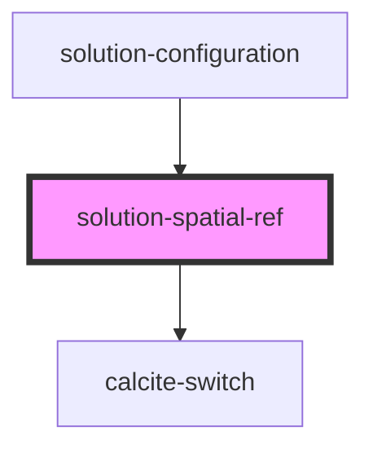

# solution-spatial-ref

<!-- Auto Generated Below -->

## Properties

| Property          | Attribute        | Description                                                             | Type                             | Default |
| ----------------- | ---------------- | ----------------------------------------------------------------------- | -------------------------------- | ------- |
| `enableDefault`   | `enable-default` | When true, a default value is used for feature services.                | `boolean`                        | `false` |
| `enabled`         | `enabled`        | When true, all but the main switch are disabled to prevent interaction. | `boolean`                        | `false` |
| `featureServices` | --               | List of services the spatial reference should apply to                  | `IFeatureServiceEnabledStatus[]` | `[]`    |

## Events

| Event                                  | Description | Type                                        |
| -------------------------------------- | ----------- | ------------------------------------------- |
| `enableDefaultSpatialReferenceChange`  |             | `CustomEvent<{ defaultWkid: string; }>`     |
| `enabledSpatialReferenceChange`        |             | `CustomEvent<{ enabled: boolean; }>`        |
| `featureServiceSpatialReferenceChange` |             | `CustomEvent<IFeatureServiceEnabledStatus>` |

## Methods

### `_testAccess(methodName: string, _arg1?: any, _arg2?: any, _arg3?: any) => Promise<any>`

Provides access to protected methods for unit testing.

#### Parameters

| Name         | Type     | Description                                                                                        |
| ------------ | -------- | -------------------------------------------------------------------------------------------------- |
| `methodName` | `string` | Name of protected method to run                                                                    |
| `_arg1`      | `any`    | First argument to forward to method, e.g., for "_prepareSolutionItemsForEditing", `solutionItemId` |
| `_arg2`      | `any`    | Second argument to forward to method, e.g., for "_prepareSolutionItemsForEditing", `templates`     |
| `_arg3`      | `any`    | Third argument to forward to method, e.g., for "_prepareSolutionItemsForEditing", `authentication` |

#### Returns

Type: `Promise<any>`

## Dependencies

### Used by

 - [solution-configuration](../solution-configuration)

### Depends on

- calcite-switch

### Graph

----------------------------------------------

*Built with [StencilJS](https://stenciljs.com/)*
