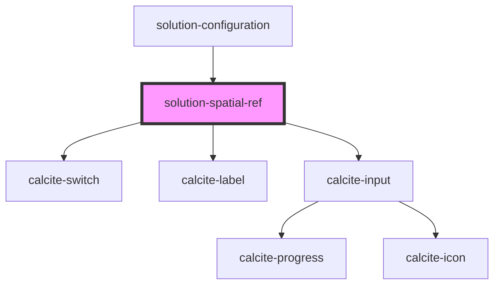

# solution-spatial-ref

<!-- Auto Generated Below -->

## Properties

| Property       | Attribute      | Description | Type  | Default                                                                                                                                                           |
| -------------- | -------------- | ----------- | ----- | ----------------------------------------------------------------------------------------------------------------------------------------------------------------- |
| `translations` | `translations` |             | `any` | `{     "specifyParam": "Spatial Reference Parameter",     "defaultSpatialRef": "Default Spatial Reference",     "featureServicesHeading": "Feature Services"   }` |
| `value`        | `value`        |             | `any` | `null`                                                                                                                                                            |

## Dependencies

### Used by

 - [solution-configuration](../solution-configuration)

### Depends on

- calcite-switch
- calcite-label
- calcite-input

### Graph

----------------------------------------------

*Built with [StencilJS](https://stenciljs.com/)*
