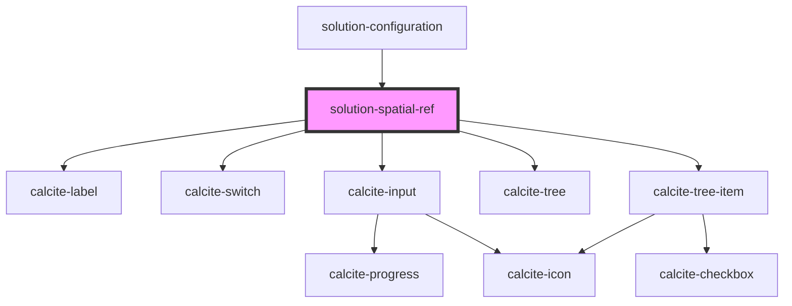

# solution-spatial-ref

<!-- Auto Generated Below -->

## Properties

| Property      | Attribute      | Description                                                                     | Type       | Default                       |
| ------------- | -------------- | ------------------------------------------------------------------------------- | ---------- | ----------------------------- |
| `defaultWkid` | `default-wkid` | The wkid that will be used as the default when no user selection has been made. | `number`   | `102100`                      |
| `locked`      | `locked`       | When true, all but the main switch are disabled to prevent interaction.         | `any`      | `undefined`                   |
| `services`    | --             | List of service names the spatial reference should apply to                     | `string[]` | `[]`                          |
| `value`       | `value`        | Contains the public value for this component.                                   | `string`   | `this.defaultWkid.toString()` |

## Events

| Event                                  | Description | Type               |
| -------------------------------------- | ----------- | ------------------ |
| `featureServiceSpatialReferenceChange` |             | `CustomEvent<any>` |

## Methods

### `createSpatialRefDisplay(value: string) => Promise<ISpatialRefRepresentation>`

Returns the spatial reference description of the supplied value.
(Exposes protected method `_createSpatialRefDisplay` for testing.)

#### Returns

Type: `Promise<ISpatialRefRepresentation>`

If component is using a WKID, description using WKID; otherwise, the WKT; defaults to 102100

### `getSpatialRef() => Promise<ISpatialRefRepresentation>`

Returns the current spatial reference description.
(Exposes protected variable `spatialRef` for testing.)

#### Returns

Type: `Promise<ISpatialRefRepresentation>`

### `wkidToDisplay(wkid: number) => Promise<string>`

Converts a WKID into a spatial reference description.
(Exposes protected method `_wkidToDisplay` for testing.)

#### Returns

Type: `Promise<string>`

Description, or "WKID &lt;wkid&gt;" if a description doesn't exist for the WKID

## Dependencies

### Used by

 - [solution-configuration](../solution-configuration)

### Depends on

- calcite-label
- calcite-switch
- calcite-input
- calcite-tree
- calcite-tree-item

### Graph

----------------------------------------------

*Built with [StencilJS](https://stenciljs.com/)*
