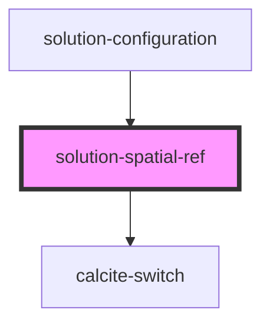

# solution-spatial-ref

<!-- Auto Generated Below -->

## Properties

| Property        | Attribute        | Description                                                                                                                         | Type                             | Default                       |
| --------------- | ---------------- | ----------------------------------------------------------------------------------------------------------------------------------- | -------------------------------- | ----------------------------- |
| `defaultWkid`   | `default-wkid`   | The wkid that will be used as the default when no user selection has been made.                                                     | `number`                         | `3857`                        |
| `enableDefault` | `enable-default` | When true, all but the main switch are disabled to prevent interaction.                                                             | `boolean`                        | `false`                       |
| `enabled`       | `enabled`        | When true, all but the main switch are disabled to prevent interaction.                                                             | `boolean`                        | `false`                       |
| `loaded`        | `loaded`         | Indicates if the control has been enabled. The first time Spatial Reference has been enabled it should enable all feature services. | `boolean`                        | `false`                       |
| `services`      | --               | List of services the spatial reference should apply to                                                                              | `IFeatureServiceEnabledStatus[]` | `[]`                          |
| `value`         | `value`          | Contains the public value for this component, which is a wkid or a wkt.                                                             | `string`                         | `this.defaultWkid.toString()` |

## Events

| Event                                  | Description | Type                                        |
| -------------------------------------- | ----------- | ------------------------------------------- |
| `enableDefaultSpatialReferenceChange`  |             | `CustomEvent<{ enableDefault: boolean; }>`  |
| `enabledSpatialReferenceChange`        |             | `CustomEvent<{ enabled: boolean; }>`        |
| `featureServiceSpatialReferenceChange` |             | `CustomEvent<IFeatureServiceEnabledStatus>` |

## Methods

### `_testAccess(methodName: string, _arg1?: any, _arg2?: any, _arg3?: any) => Promise<any>`

Provides access to protected methods for unit testing.

#### Parameters

| Name         | Type     | Description                                                                                        |
| ------------ | -------- | -------------------------------------------------------------------------------------------------- |
| `methodName` | `string` | Name of protected method to run                                                                    |
| `_arg1`      | `any`    | First argument to forward to method, e.g., for "_prepareSolutionItemsForEditing", `solutionItemId` |
| `_arg2`      | `any`    | Second argument to forward to method, e.g., for "_prepareSolutionItemsForEditing", `templates`     |
| `_arg3`      | `any`    | Third argument to forward to method, e.g., for "_prepareSolutionItemsForEditing", `authentication` |

#### Returns

Type: `Promise<any>`

## Dependencies

### Used by

 - [solution-configuration](../solution-configuration)

### Depends on

- calcite-switch

### Graph

----------------------------------------------

*Built with [StencilJS](https://stenciljs.com/)*
