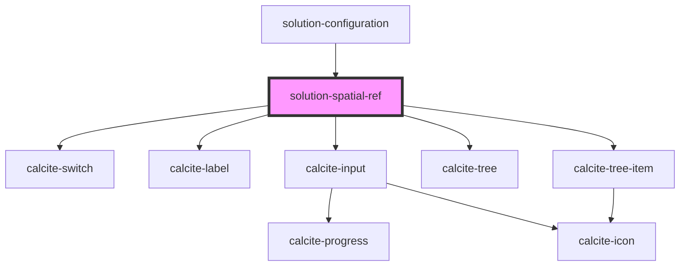

# solution-spatial-ref

<!-- Auto Generated Below -->

## Properties

| Property       | Attribute      | Description                                                             | Type       | Default  |
| -------------- | -------------- | ----------------------------------------------------------------------- | ---------- | -------- |
| `defaultWkid`  | `default-wkid` |                                                                         | `number`   | `102100` |
| `locked`       | `locked`       | When true, all but the main switch are disabled to prevent interaction. | `boolean`  | `true`   |
| `services`     | --             | List of service names the spatial reference should apply to             | `string[]` | `[]`     |
| `translations` | `translations` | Contains the translations for this component.                           | `any`      | `{}`     |
| `value`        | `value`        | Contains the public value for this component.                           | `string`   | `null`   |

## Methods

### `createSpatialRefDisplay(value: string) => Promise<ISpatialRefRepresentation>`

Returns the spatial reference description of the supplied value.
(Exposes private method `_createSpatialRefDisplay` for testing.)

#### Returns

Type: `Promise<ISpatialRefRepresentation>`

### `getSpatialRef() => Promise<ISpatialRefRepresentation>`

Returns the current spatial reference description.
(Exposes private variable `spatialRef` for testing.)

#### Returns

Type: `Promise<ISpatialRefRepresentation>`

### `wkidToDisplay(wkid: number) => Promise<string>`

Converts a WKID into a spatial reference description.
(Exposes private method `_wkidToDisplay` for testing.)

#### Returns

Type: `Promise<string>`

## Dependencies

### Used by

 - [solution-configuration](../solution-configuration)

### Depends on

- calcite-switch
- calcite-label
- calcite-input
- calcite-tree
- calcite-tree-item

### Graph

----------------------------------------------

*Built with [StencilJS](https://stenciljs.com/)*
