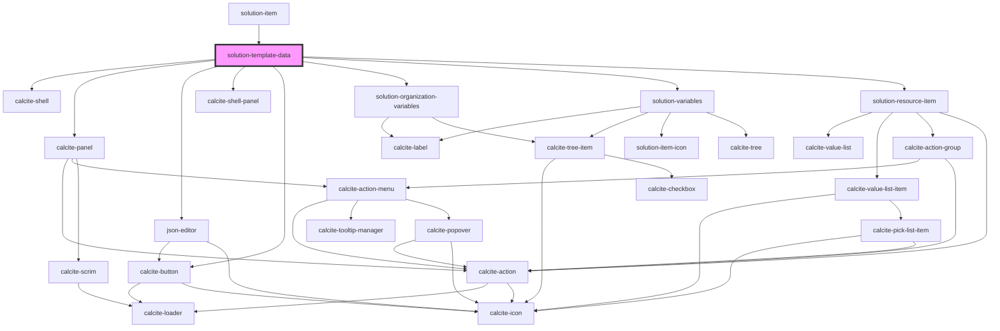

# solution-template-data

<!-- Auto Generated Below -->

## Properties

| Property                | Attribute      | Description                                                                                                                                                                                     | Type                          | Default     |
| ----------------------- | -------------- | ----------------------------------------------------------------------------------------------------------------------------------------------------------------------------------------------- | ----------------------------- | ----------- |
| `authentication`        | --             | Credentials for requests                                                                                                                                                                        | `UserSession`                 | `undefined` |
| `instanceid`            | `instanceid`   | This needs to be unique for props vs data of an item                                                                                                                                            | `string`                      | `""`        |
| `isResource`            | `is-resource`  | Should be set to true for items that store their data as a resource Will allow for upload and download of the resource                                                                          | `boolean`                     | `false`     |
| `itemid`                | `itemid`       | A templates itemId. This is used to get the correct model from a store in the json-editor                                                                                                       | `string`                      | `""`        |
| `organizationVariables` | --             | Contains the organization based variables                                                                                                                                                       | `IOrganizationVariableItem[]` | `[]`        |
| `solutionVariables`     | --             | Contains the solution based variables                                                                                                                                                           | `IVariableItem[]`             | `[]`        |
| `translations`          | `translations` | Contains the translations for this component.                                                                                                                                                   | `any`                         | `{}`        |
| `value`                 | --             | Contains the public value for this component.  When working with a resource item this should contain an IResourceItem  When working with a json type item this should contain the data and vars | `ITemplateData`               | `{}`        |
| `varsOpen`              | `vars-open`    | Used to show/hide the variable containers                                                                                                                                                       | `boolean`                     | `true`      |

## Dependencies

### Used by

 - [solution-item](../solution-item)

### Depends on

- calcite-shell
- calcite-panel
- [json-editor](../json-editor)
- calcite-shell-panel
- calcite-button
- [solution-organization-variables](../solution-organization-variables)
- [solution-variables](../solution-variables)
- [solution-resource-item](../solution-resource-item)

### Graph

----------------------------------------------

*Built with [StencilJS](https://stenciljs.com/)*
