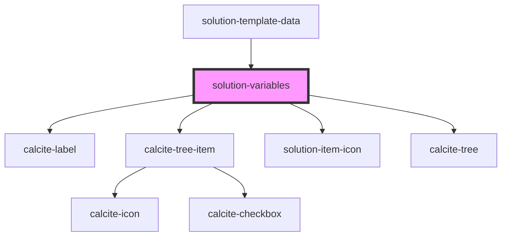

# solution-variables

<!-- Auto Generated Below -->

## Properties

| Property       | Attribute      | Description                                   | Type              | Default |
| -------------- | -------------- | --------------------------------------------- | ----------------- | ------- |
| `translations` | `translations` | Contains the translations for this component. | `any`             | `{}`    |
| `value`        | --             | Contains the public value for this component. | `IVariableItem[]` | `[]`    |

## Events

| Event                      | Description | Type               |
| -------------------------- | ----------- | ------------------ |
| `solutionVariableSelected` |             | `CustomEvent<any>` |

## Dependencies

### Used by

 - [solution-template-data](../solution-template-data)

### Depends on

- calcite-label
- calcite-tree-item
- [solution-item-icon](../solution-item-icon)
- calcite-tree

### Graph

----------------------------------------------

*Built with [StencilJS](https://stenciljs.com/)*
