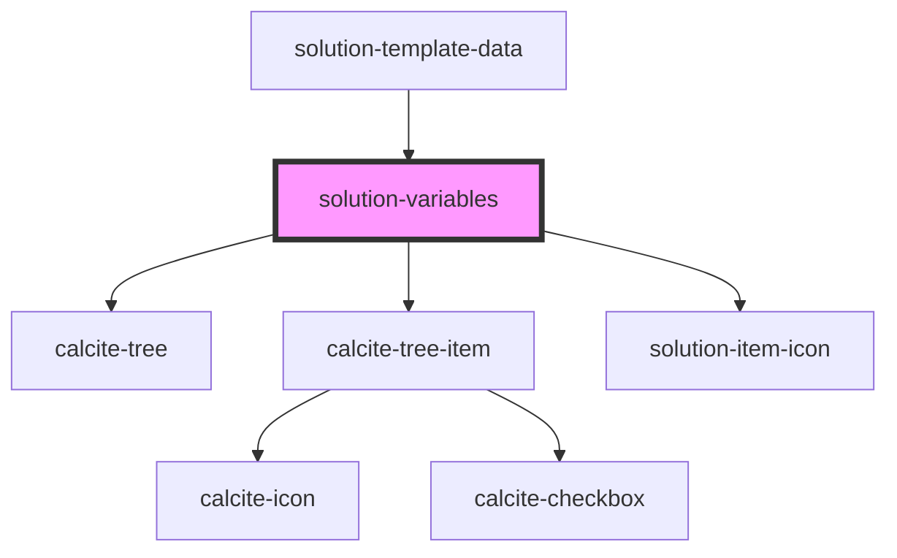

# solution-variables

<!-- Auto Generated Below -->

## Properties

| Property | Attribute | Description                                   | Type     | Default |
| -------- | --------- | --------------------------------------------- | -------- | ------- |
| `value`  | `value`   | Contains the public value for this component. | `string` | `""`    |

## Events

| Event                      | Description | Type                                              |
| -------------------------- | ----------- | ------------------------------------------------- |
| `solutionVariableSelected` |             | `CustomEvent<{ itemId: string; value: string; }>` |

## Dependencies

### Used by

 - [solution-template-data](../solution-template-data)

### Depends on

- calcite-tree
- calcite-tree-item
- [solution-item-icon](../solution-item-icon)

### Graph

----------------------------------------------

*Built with [StencilJS](https://stenciljs.com/)*
