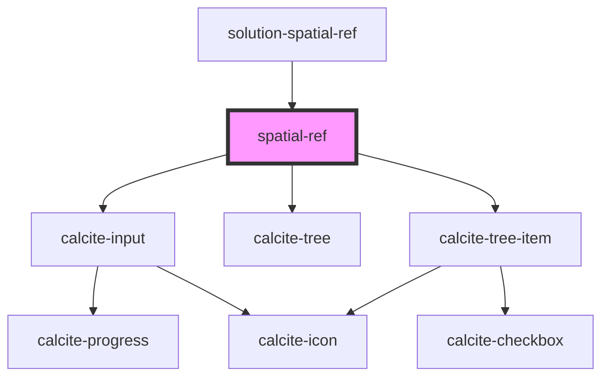

# spatial-ref

<!-- Auto Generated Below -->

## Properties

| Property      | Attribute      | Description                                                                     | Type      | Default                       |
| ------------- | -------------- | ------------------------------------------------------------------------------- | --------- | ----------------------------- |
| `defaultWkid` | `default-wkid` | The wkid that will be used as the default when no user selection has been made. | `number`  | `102100`                      |
| `disabled`    | `disabled`     | When true, all are disabled to prevent interaction.                             | `boolean` | `false`                       |
| `value`       | `value`        | Contains the public value for this component, which is a wkid or a wkt.         | `string`  | `this.defaultWkid.toString()` |

## Events

| Event                    | Description | Type                        |
| ------------------------ | ----------- | --------------------------- |
| `spatialReferenceChange` |             | `CustomEvent<IValueChange>` |

## Methods

### `createSpatialRefDisplay(value: string) => Promise<ISpatialRefRepresentation>`

Returns the spatial reference description of the supplied value.
(Exposes protected method `_createSpatialRefDisplay` for testing.)

#### Returns

Type: `Promise<ISpatialRefRepresentation>`

If component is using a WKID, description using WKID; otherwise, the WKT; defaults to 102100

### `getSpatialRef() => Promise<ISpatialRefRepresentation>`

Returns the current spatial reference description.
(Exposes protected variable `spatialRef` for testing.)

#### Returns

Type: `Promise<ISpatialRefRepresentation>`

### `wkidToDisplay(wkid: number) => Promise<string>`

Converts a WKID into a spatial reference description.
(Exposes protected method `_wkidToDisplay` for testing.)

#### Returns

Type: `Promise<string>`

Description, or "WKID &lt;wkid&gt;" if a description doesn't exist for the WKID

## Dependencies

### Used by

 - [solution-spatial-ref](../solution-spatial-ref)

### Depends on

- calcite-input
- calcite-tree
- calcite-tree-item

### Graph

----------------------------------------------

*Built with [StencilJS](https://stenciljs.com/)*
